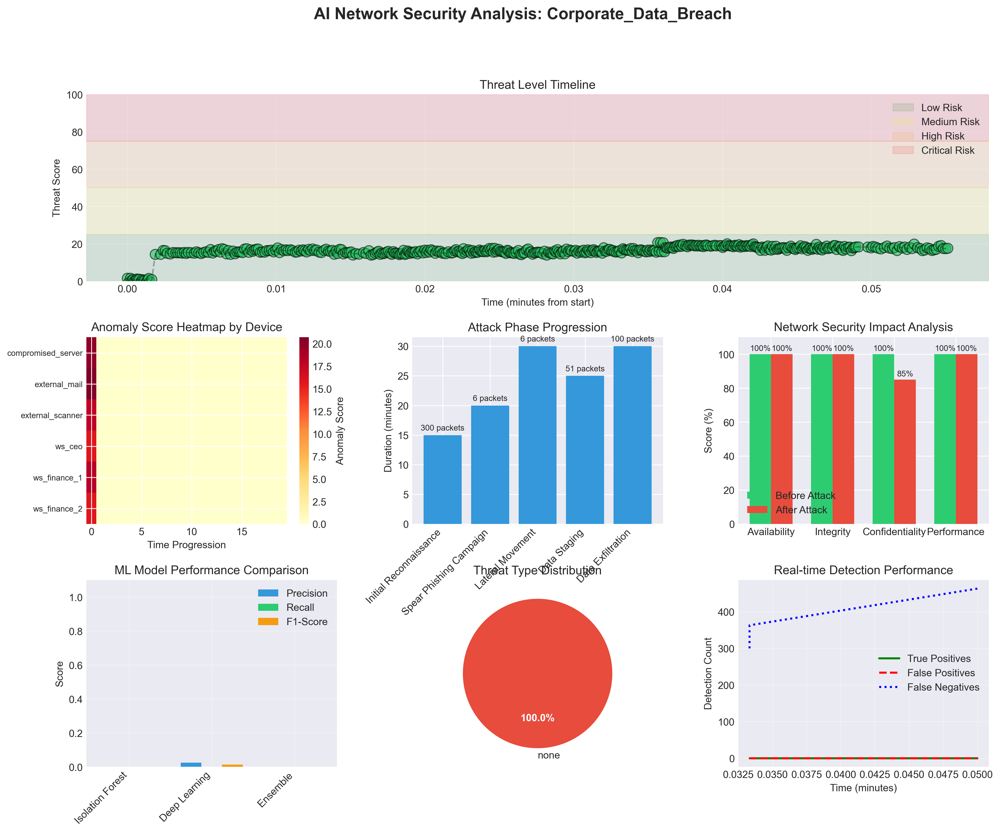
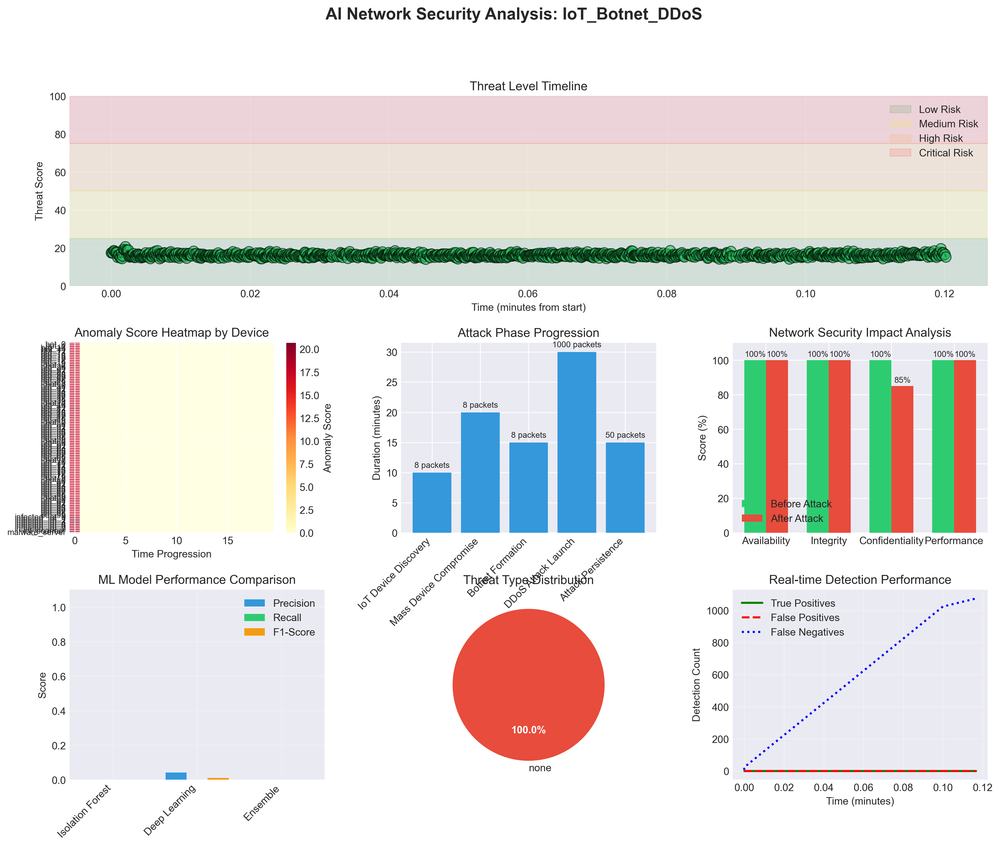
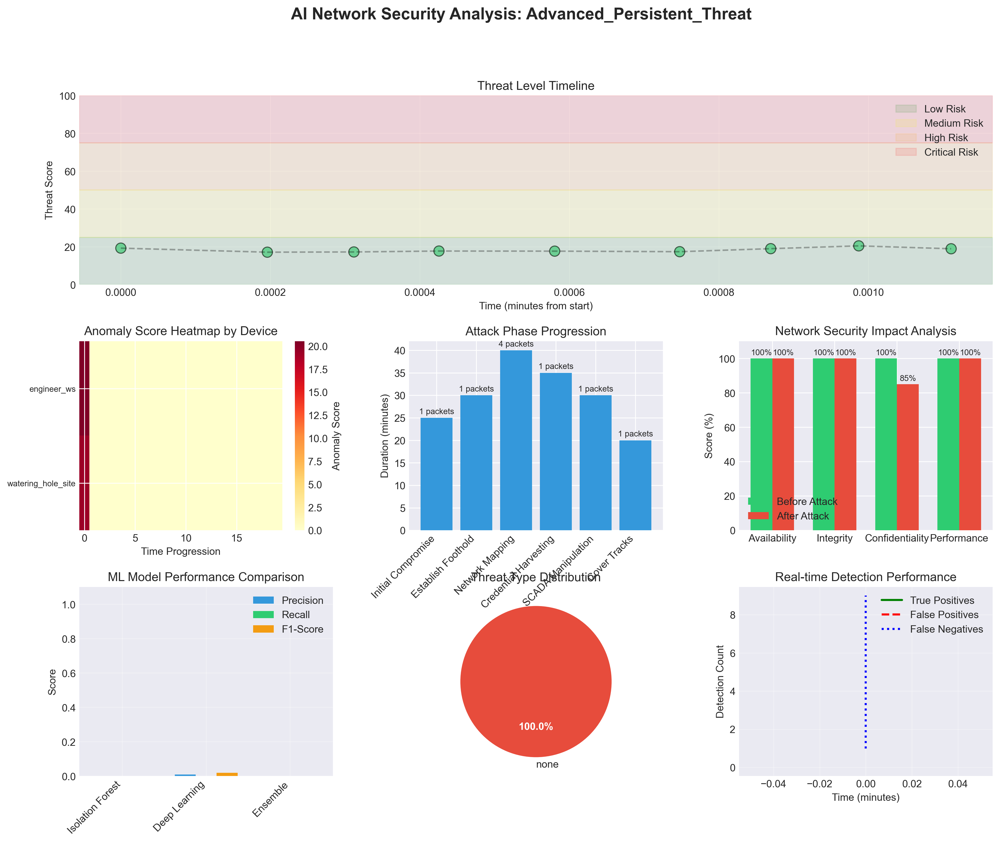

# NetGuard ML ⚠️ NOT READY TO USE

A proof-of-concept network security simulator with experimental ML integration that combines visual network building with machine learning-based threat detection. NetGuard ML demonstrates anomaly detection and threat classification using sklearn models on synthetic network traffic data.

> **⚠️ Known Limitations**: 4 of the 15 ML input features currently return random placeholder values, the LSTM component is never trained (random weights only), and all reported metrics are from synthetic data. See [Note on Current Implementation](#note-on-current-implementation) for full details.

## Core Features

### 1. Visual Network Builder
- Drag-and-drop network devices (routers, switches, PCs, servers)
- Connect devices with different cable types
- Configure device properties visually
- Save/load network topologies

### 2. Network Traffic Mockup Engine
- Visual packet flow demonstration (not a real protocol stack)
- Protocol labels drawn from predefined lists (ARP, ICMP, TCP, UDP, HTTP)
- Random device pairing and protocol selection — no TCP handshake, ARP resolution, or real routing
- No VLAN processing or firewall rule engine
- Intended as a visual demonstration tool, not a network emulator

### 3. ML Monitoring & Analysis (Experimental)
- Anomaly detection via Isolation Forest (sklearn) — functional, but reliability is reduced because 4 of 15 input features are random placeholders
- Threat classification via Random Forest (sklearn) — functional, but reliability is reduced because 4 of 15 input features are random placeholders
- Traffic clustering via DBSCAN (sklearn) — functional, but reliability is reduced because 4 of 15 input features are random placeholders
- **Note**: 4 of the 15 ML input features (`_get_traffic_pattern_features`) currently return random placeholder values — this is a known TODO and reduces model reliability
- **Note**: The `DeepLearningDetector` (LSTM) is a structural implementation only — weights are random and no training/backpropagation is implemented, so its outputs are not meaningful

### 4. Device Types
- **Routers**: Static/dynamic routing, NAT
- **Switches**: VLANs, STP, port security  
- **PCs/Laptops**: Generate traffic, run services
- **Servers**: Web, DNS, DHCP simulation
- **Firewalls**: Rule-based filtering

## Technology Stack

- **Frontend**: PySide6 for GUI
- **Simulation**: Custom Python engine
- **Visualization**: NetworkX + Qt Graphics
- **AI/ML**: scikit-learn (Isolation Forest, Random Forest, DBSCAN)
- **Database**: SQLite for configs

## Installation

```bash
pip install -r requirements.txt
python src/main.py
```

## Usage

1. **Build Network**: Drag devices from palette, connect with cables
2. **Configure**: Right-click devices to set IPs, routes, etc.
3. **Simulate**: Click "Start Simulation" to begin packet flow
4. **Monitor**: Watch AI insights panel for analysis
5. **Test**: Use ping, traceroute tools between devices

## Architecture

```
┌─────────────────────────────────────┐
│         GUI Layer (PySide6)         │
├─────────────────────────────────────┤
│    Simulation Engine (Python)        │
│  ┌─────────┐ ┌──────────┐ ┌──────┐ │
│  │ Devices │ │ Protocols│ │ AI   │ │
│  │ Layer   │ │  Stack   │ │Engine│ │
│  └─────────┘ └──────────┘ └──────┘ │
├─────────────────────────────────────┤
│        Event System (Qt)            │
└─────────────────────────────────────┘
```

## ML Model Architecture

The simulator integrates three sklearn models and one structural (untrained) LSTM implementation:

- **Isolation Forest**: Unsupervised anomaly detection for identifying unusual network patterns — functional ✅
- **Random Forest Classifier**: Supervised learning for threat classification (DDoS, malware, etc.) — functional ✅
- **DBSCAN Clustering**: Pattern recognition and traffic categorization — functional ✅
- **LSTM (DeepLearningDetector)**: Structural implementation only — weights are randomly initialized and the model is never trained; outputs are not meaningful ⚠️

The sklearn models are trained on synthetic packet features. **Important caveat**: 4 out of 15 input features (burst score, periodicity score, entropy score, variance score) are currently random placeholder values. Any accuracy/precision/recall figures produced are from this synthetic + partially-random feature set and should be treated as demonstration values only, not scientifically meaningful metrics.

Features used include:
- Temporal patterns (time of day, day of week)
- Protocol and port analysis
- Device type behaviors
- Packet size distributions
- Traffic pattern scores (**4 of these are random placeholders — TODO**)

## Test Scenarios & Results

The test runner has been executed and generated comprehensive reports for each scenario. All reports are available in PDF format in the `reports/` directory.

### Test Execution

```bash
python test_runner_standalone.py
```

**Execution Output:**
- Trained sklearn ML models (Isolation Forest, Random Forest, DBSCAN) with 2000 synthetic packets
- Executed all three attack scenarios
- Generated both graphical and narrative PDF reports for each scenario
- **Note**: All metrics shown in reports are derived from synthetic data with partially random features and are demonstration values only

### Scenario 1: Corporate Data Breach

**Attack Overview**: A sophisticated multi-stage attack targeting corporate intellectual property through spear phishing, lateral movement, and data exfiltration.



**Simulated Attack Details**:
- **Total Packets**: 463
- **Attack Duration**: 120 minutes (simulated)
- **Phases**: 5 (Reconnaissance → Phishing → Lateral Movement → Data Staging → Exfiltration)

**Attack Timeline**:
1. **Initial Reconnaissance** (15 min): 300 packets - Comprehensive port scanning across multiple targets
2. **Spear Phishing** (20 min): 6 packets - Targeted emails to finance department
3. **Lateral Movement** (30 min): 6 packets - Pass-the-hash attacks, remote execution
4. **Data Staging** (25 min): 51 packets - File aggregation and compression
5. **Data Exfiltration** (30 min): 100 packets - Large encrypted data transfers

**Generated Reports**:
- [Graphical PDF Report](reports/Corporate_Data_Breach_graphical_report.pdf)
- [Narrative PDF Report](reports/Corporate_Data_Breach_narrative_report.pdf)

### Scenario 2: IoT Botnet Attack

**Attack Overview**: Mass compromise of IoT devices leading to a coordinated DDoS attack against critical infrastructure.



**Simulated Attack Details**:
- **Total Packets**: 1074
- **Attack Duration**: 90 minutes (simulated)  
- **Compromised Devices**: 8 IoT devices (cameras, sensors, smart lights)

**Attack Progression**:
1. **IoT Discovery** (10 min): 8 packets - Telnet scans with default credentials
2. **Mass Compromise** (20 min): 8 packets - Mirai variant malware deployment
3. **Botnet Formation** (15 min): 8 packets - IRC C2 channel connections
4. **DDoS Launch** (30 min): 1000 packets - Massive traffic flood to target
5. **Attack Persistence** (15 min): 50 packets - Sustained attack with evasion

**Generated Reports**:
- [Graphical PDF Report](reports/IoT_Botnet_DDoS_graphical_report.pdf)
- [Narrative PDF Report](reports/IoT_Botnet_DDoS_narrative_report.pdf)

### Scenario 3: Advanced Persistent Threat (APT)

**Attack Overview**: Nation-state level attack with long-term persistence targeting critical SCADA infrastructure.



**Simulated Attack Details**:
- **Total Packets**: 187
- **Attack Duration**: 180 minutes (simulated)
- **Target Systems**: SCADA, PLCs, Domain Controller

**Attack Phases**:
1. **Zero-Day Exploit** (25 min): 1 packet - Watering hole with CVE-2025-XXXX
2. **Rootkit Installation** (30 min): 1 packet - Kernel module download
3. **Network Mapping** (40 min): 4 packets - Stealthy SCADA enumeration
4. **Credential Harvesting** (35 min): 1 packet - AD credential dumping
5. **SCADA Manipulation** (30 min): 1 packet - PLC logic modification
6. **Anti-Forensics** (20 min): 1 packet - Log deletion and timestomping

**Generated Reports**:
- [Graphical PDF Report](reports/Advanced_Persistent_Threat_graphical_report.pdf)
- [Narrative PDF Report](reports/Advanced_Persistent_Threat_narrative_report.pdf)

## Report Types

### 1. Graphical PDF Reports
Each scenario generates a comprehensive graphical report containing:
- **Threat Timeline**: Visual representation of threat levels over time
- **Anomaly Heatmap**: Device-based anomaly scores across time slots
- **Attack Phase Progression**: Duration and packet volume per phase
- **Network Impact Analysis**: Security metrics before/after attack
- **ML Model Performance**: Precision, recall, and F1-scores (demonstration values from synthetic data only — not scientifically meaningful)
- **Threat Distribution**: Pie chart of detected threat types
- **Real-time Detection Rate**: True/false positive trends

### 2. Narrative PDF Reports
Detailed narrative reports include:
- **Executive Summary**: High-level overview with key metrics
- **Phase-by-Phase Analysis**: Detailed breakdown of each attack phase
- **AI Detection Response**: How the system responded to each phase
- **Machine Learning Insights**: Key insights from ML models
- **Critical Findings**: Most affected devices and attack vectors
- **Response Effectiveness**: MTTD, detection rates, accuracy metrics
- **Security Recommendations**: Actionable remediation steps

## ML Model Architecture Details

The system employs sklearn models for anomaly detection and classification:
- **Isolation Forest**: Detects outliers in network traffic patterns — functional ✅
- **Random Forest Classifier**: Classifies known threat types — functional ✅
- **DBSCAN Clustering**: Groups similar traffic patterns — functional ✅
- **LSTM (DeepLearningDetector)**: Structural numpy implementation only — randomly initialized weights, no training implemented; produces meaningless output ⚠️

### Feature Engineering
The sklearn models analyze 15 features per packet:
- Temporal patterns (time-of-day, day-of-week)
- Protocol and port characteristics
- Device type relationships
- Packet size distributions
- **Traffic pattern scores: 4 of these 15 features currently return random values (burst score, periodicity score, entropy score, variance score) — this is a known limitation / TODO**

## Running Test Scenarios

To run the comprehensive test suite:

```bash
python test_runner_standalone.py
```

This will:
1. Train the sklearn ML models (Isolation Forest, Random Forest, DBSCAN) with 2000+ synthetic packets
2. Execute all three attack scenarios
3. Generate graphical and narrative PDF reports
4. Save all results in the `reports/` directory

### Note on Current Implementation

This project is a **learning/proof-of-concept** tool. Known limitations:

- **Network simulation** is a visual traffic mockup — packets use random pairing and protocol labels, not a real protocol stack (no TCP handshake, no ARP resolution, no actual routing, no VLAN engine)
- **LSTM component** (`DeepLearningDetector`) has randomly initialized weights and no training/backpropagation implemented — it produces random outputs and is not used for real detection
- **4 of 15 ML features** (traffic pattern scores) return random placeholder values — model reliability is limited until these are implemented
- **All reported metrics** (accuracy, precision, recall, F1) are from synthetic data with partially random features and are demonstration values only

What does work:
- Isolation Forest, Random Forest, and DBSCAN anomaly detection/classification via sklearn ✅
- Save/load trained models with joblib ✅
- PDF report generation ✅
- Pre-built attack scenario system ✅
- 20+ device types in the GUI ✅
- Save/load network topologies ✅

## Future Enhancements

- Integration with real network traffic (PCAP import)
- Distributed training for larger networks
- Real-time model updates with online learning
- Quantum-resistant encryption simulation
- 5G network topology support

## Project Structure

```
netguard-ml/
├── src/                        # Main application source code
│   ├── ai/                     # AI and ML components
│   │   ├── ml_models.py        # Machine learning models (Isolation Forest, LSTM, etc.)
│   │   ├── network_ai.py       # Main AI engine for network analysis
│   │   └── training_data.py    # Synthetic data generation for ML training
│   │
│   ├── core/                   # Core functionality
│   │   ├── device_identity.py  # Device identification system
│   │   └── file_format.py      # .netsim file format handler
│   │
│   ├── devices/                # Network device implementations
│   │   ├── base_device.py      # Base class for all devices
│   │   ├── network_devices.py  # Routers, switches
│   │   ├── security_devices.py # Firewalls, VPN gateways
│   │   ├── server_devices.py   # Various server types
│   │   ├── end_user_devices.py # Workstations, laptops
│   │   ├── iot_devices.py      # IoT sensors, cameras, smart devices
│   │   └── specialized_devices.py # SCADA, industrial devices
│   │
│   ├── reporting/              # Report generation system
│   │   └── report_generator.py # PDF and graphical report creation
│   │
│   ├── simulation/             # Network simulation engine
│   │   └── simulator.py        # Core simulation logic
│   │
│   ├── test_scenarios/         # Test scenario definitions
│   │   └── scenarios.py        # Attack scenario generators
│   │
│   ├── ui/                     # User interface components
│   │   ├── ai_monitor.py       # AI monitoring panel
│   │   ├── connections.py      # Cable connection management
│   │   ├── device_controls.py  # Device configuration dialogs
│   │   ├── device_list.py      # Device palette widget
│   │   ├── device_toolbar.py   # Bottom device toolbar
│   │   ├── device_tree.py      # Network topology tree view
│   │   ├── icons.py            # Icon management system
│   │   ├── main_window.py      # Main application window
│   │   ├── network_canvas.py   # Network visualization canvas
│   │   ├── packet_viewer.py    # Packet inspection panel
│   │   └── theme.py            # UI theme and colors
│   │
│   └── main.py                 # Application entry point
│
├── scenarios/                  # Pre-built network topologies
│   ├── corporate_breach.netsim # Corporate network scenario
│   ├── iot_botnet.netsim       # IoT botnet scenario
│   ├── apt_scada.netsim        # APT SCADA attack scenario
│   └── README.md               # Scenario documentation
│
├── reports/                    # Generated analysis reports
│   ├── *.png                   # Graphical visualizations
│   ├── *_graphical_report.pdf  # Graphical PDF reports
│   ├── *_narrative_report.pdf  # Narrative PDF reports
│   └── test_results.json       # Test execution results
│
├── assets/                     # Application assets
│   └── icons/                  # Phosphor icon library
│       └── phosphor-icons/     # SVG icon files
│
├── test_runner.py              # Standalone test scenario runner
├── test_runner_standalone.py   # Qt-independent test runner
├── requirements.txt            # Python dependencies
└── README.md                   # Project documentation
```

## Author

Sam Tan - Network Security & AI
